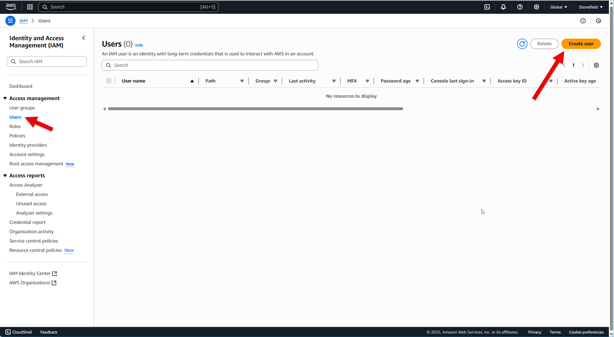
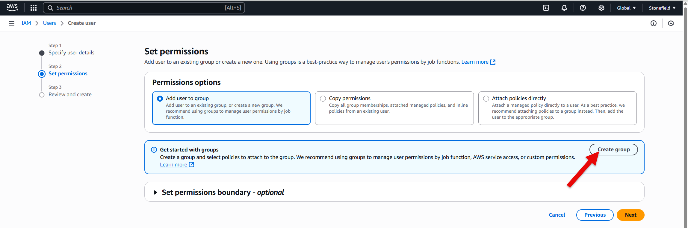
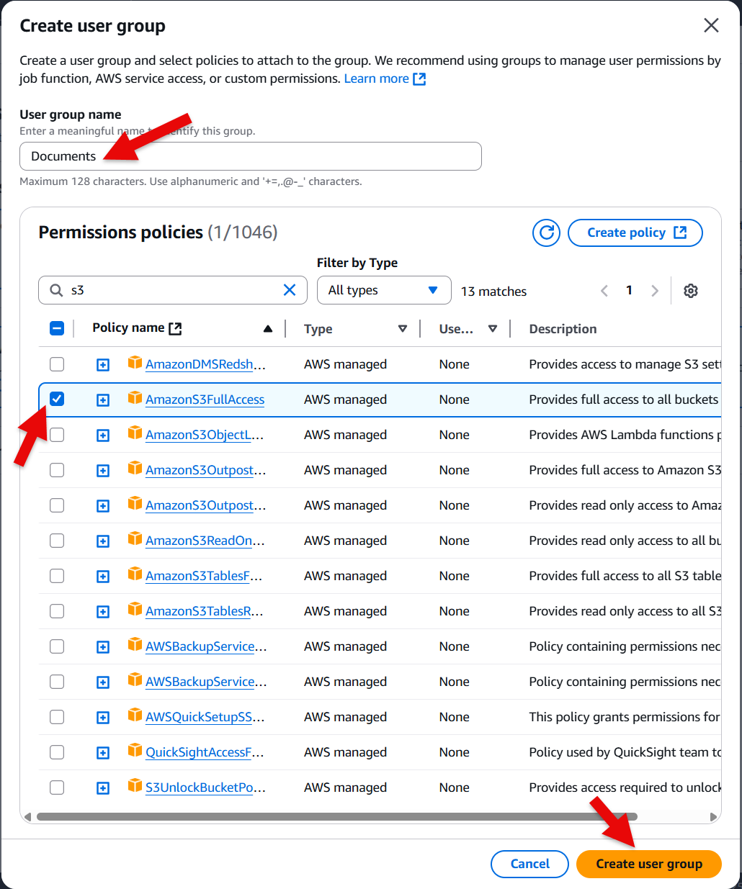
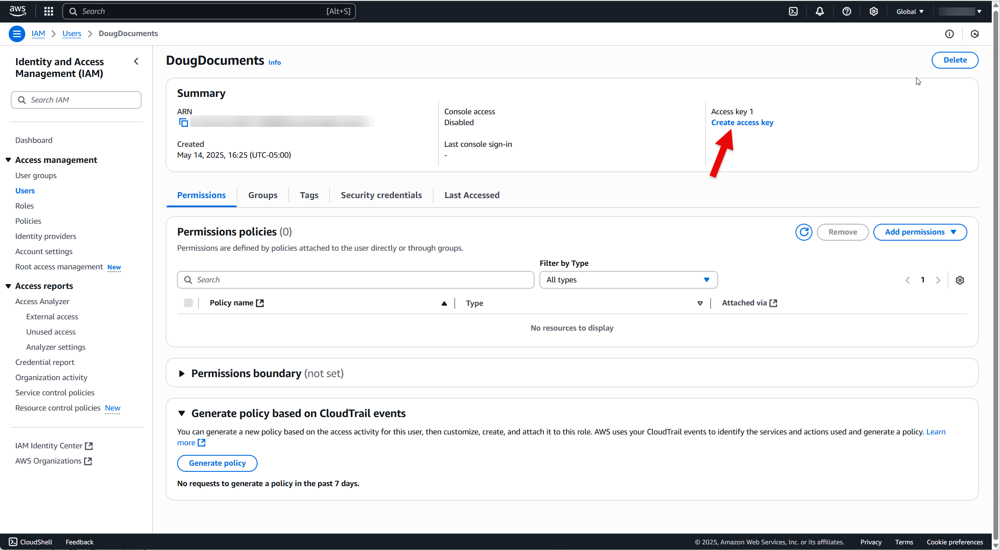
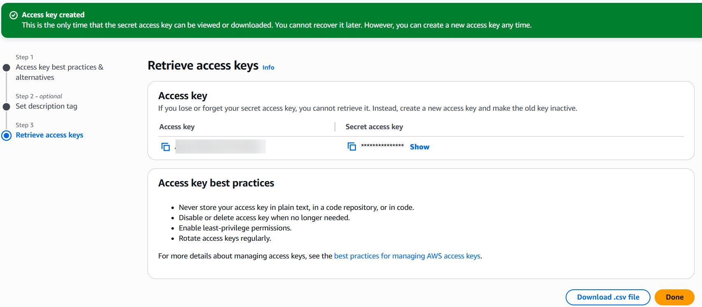
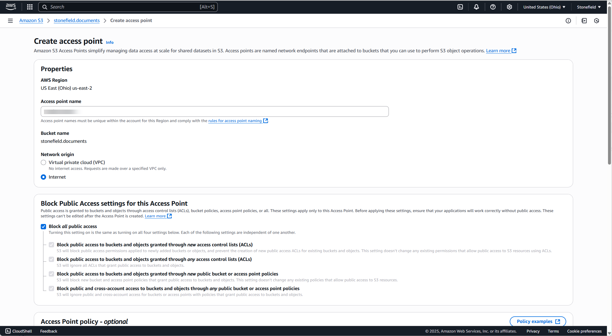

# Setting up Amazon S3

Amazon Simple Storage Service (S3) is an object storage service that's part of the Amazon Web Services (AWS) stack. It's used by lots of companies to store things like documents, video files, backups, and so on. S3 is inexpensive: about $0.02 per GB per month; see https://aws.amazon.com/s3/pricing for details. There is also a free tier: a 12-month trial that provides 5GB of storage at no cost.

To store data in S3, you work with buckets and objects. A bucket is a container for objects. An object is a file and any metadata that describes that file.

See https://docs.aws.amazon.com/AmazonS3/latest/userguide/Welcome.html for more information about S3.

## Creating an AWS account

* Navigate your browser to https://aws.amazon.com/pm/serv-s3 and click Create an AWS Account or Create a Free Account.

* Go through the various steps to complete the signup.

* Navigate to https://console.aws.amazon.com/iam/home?#security_credential and follow the steps to complete registration, including setting up multi-factor authentication if desired.

* Click Users under Access Management and click Create User.

* Enter a user name and click Next. Click Create Group in the Set Permissions step.

* Enter a user group name such as Documents, enter S3 in the search textbox, and check AmazonS3FullAccess. Click Create User Group.

* The new group appears in the User Groups list. Click Next, then click Create User in the Review and Create Step.

* The user name appears in the User list. Click the name, then click Create Access Key.

* For Access Key Best Practices & Alternatives, select Other, click Next, then click Create Access Key. The Retrieve Access Keys step displays the Access Key and Secret Access Key. Copy these both and store them somewhere (or click Download .csv File), since the secret access key can never be viewed or downloaded again. Then click Done.

* Click Dashboard in the panel at the left and copy the Sign-In URL for IAM Users in This Account to get URL to sign into.

## Setting up S3 buckets

* Navigate to https://aws.amazon.com/s3 and click Sign In to the Console.

* Click the View All Services link in the Console Home section and click S3.

* Click the Create Bucket button. Make a note of the AWS region; it will be something like "us-east-2". Leave Bucket Type at the default of General Purpose and enter a bucket name. The name must be in all lower-case and unique across all of S3, so enter something containing your company name, mycompany.mybucket. Leave other settings at their defaults (or change them as desired) and click Create Bucket.

* The bucket name appears in the Buckets list. Click the name then click Access Points. Click Create Access Point. Enter a name, select Internet for Network Origin, leave other settings at default (or change them as desired), and click Create Access Point.

