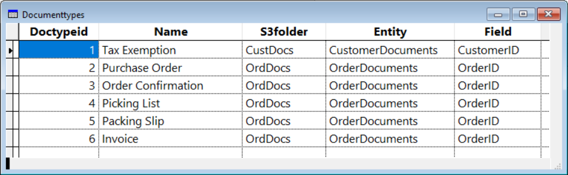
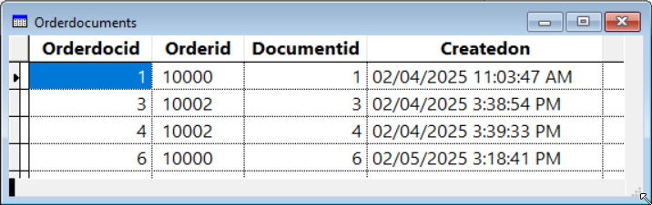
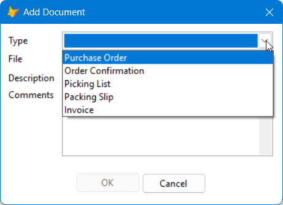

# Document wrapper class
The Document class in Document.vcx is a VFP wrapper for Document.dll, a .NET DLL that communicates with Amazon S3. The source for Document.dll is included in the Source\Document folder and was adapted from C# code written by Frank Perez.

## Properties

* cDocumentTableName: the name of the table containing document information; defaults to Documents. See the Tables section for the structure of this and the document types tables.

* cDocumentTypeTableName: the name of the table containing document types; defaults to DocumentTypes.

* cErrorMessage: the error message if a method failed.

* nHandle: the connection handle for a remote database if necessary.

## Methods

* AddDocument: adds a document to the document and document entity tables and optionally uploads it to S3.

* DeleteDocument: deletes a document.

* FindDocumentByName: finds the ID for a document from its filename or path.

* FindDocumentsForEntity: creates a cursor of documents for the specified entity ID.

* FindDocumentsForEntityAndType: creates a cursor of documents for the specified document type and entity id.

* GetDocument: gets a document by its document ID.

* GetDocumentTypesForEntity: creates a cursor of document types for the specified entity.

* Setup: sets up the document object.

* ShareDocument: shares an existing document with another entity.

## Dependencies

The Document class requires that the following files are deployed with the application:

* AWSSDK.Core.dll

* AWSSDK.S3.dll

* ClrHost.dll

* Document.dll

* wwDotNetBridge.dll

It also requires that wwDotNetBridge.prg be added to the project so it's included in the application's executable.

## Tables

The Document class uses three or more tables:

* Document
* DocumentType
* One or more document entity tables

These tables can be DBFs or SQL Server (or other remote database) tables; see the Remote Database section for information about using a remote database. The Document class does not create these tables; it expects them to exist.

### Document table

The document table contains information about documents. You can name this table anything you wish as long as you specify the name of the table in the cDocumentTableName property of the Document object. The default is Documents.

The document table has the following structure:

| Column  Name | VFP Data Type                           | SQL Server Data Type        | Description                                   |
|--------------|-----------------------------------------|-----------------------------|-----------------------------------------------|
| DocumentID   | I (autoinc, primary or candidate index) | INT (identity, primary key) | The ID for the document                       |
| DocTypeID    | I                                       | INT                         | The ID of the document type                   |
| Path         | M                                       | VARCHAR(MAX)                | The path for the original document            |
| Descrip      | C(80)                                   | VARCHAR(80)                 | The document description                      |
| FileKey      | C(200)                                  | VARCHAR(200)                | The S3 key for the document                   |
| Comments     | M                                       | VARCHAR(MAX)                | Comments for the document                     |
| FileDate     | T                                       | DATETIME                    | The last modified timestamp                   |
| CreatedOn    | T                                       | DATETIME                    | The timestamp for when the record was created |

The widths of the Descrip and FileKey columns can be something other than the widths shown here but must be wide enough for the content. The table can contain additional columns; the Document class ignores them.

### Document type table

The document type table specifies the type of documents your application uses. You can name this table anything you wish as long as you specify the name of the table in the cDocumentTypeTableName property of the Document object. The default is DocumentTypes.

The document type table has the following structure:

| Column  Name | VFP Data Type                           | SQL Server Data Type        | Description                                   |
|--------------|-----------------------------------------|-----------------------------|-----------------------------------------------|
| DocTypeID    | I (autoinc, primary or candidate index) | INT (identity, primary key) | The ID for the document type                  |
| Name         | C(50)                                  | VARCHAR(50)                  | The descriptive name of the type              |
| S3Folder     | C(50)                                   | VARCHAR(50)                 | The S3 folder where documents of this type are stored |
| Entity       | C(40)                                   | VARCHAR(40)                 | The name of the document entity table (discussed below) |
| Field        | C(40)                                   | VARCHAR(40)                 | The name of the primary key field in the entity table |

The widths of these columns can be something other than the widths shown here but must be wide enough for the content. The table can contain additional columns; the Document class ignores them.

Suppose you have an order entry system with a table named Orders which has a primary key named OrderID and a table named Customers with a primary key named CustomerID. There are five types of documents for orders: Purchase Order (which comes from your customer), Order Confirmation (produced when the purchase order is received), Picking List (produced when the order is ready to be picked for shipping), Packing Slip (produced when the order is shipped), and Invoice (produced when the order is invoiced). There's one type of document for customers: Tax Exemption (a document where the customer certifies they are tax exempt). Here's what the document type table would contain:



DocumentType is the only table you have to populate manually. The other tables are maintained by the Document class.

### Document entity table

A document entity table acts like a join table between the documents table and an entity table. An entity table is a table that has documents associated with it; in the order entry example, Orders and Customers are entity tables. There is one document entity table for each type of entity that documents are related to. In the order entry example, as specified in the Entity column in the document type table, there are document entity tables named OrderDocuments and CustomerDocuments containing information about the documents for orders and customers. Here's what the OrderDocuments table looks like:



Since it's a join table between the Orders (entity) and document tables, it contains the primary key fields from both of those tables, OrderID and DocumentID.

A document entity table has the following structure:

| Column  Name | VFP Data Type                           | SQL Server Data Type        | Description                                   |
|--------------|-----------------------------------------|-----------------------------|-----------------------------------------------|
| *entitydocid*| I (autoinc, primary or candidate index) | INT (identity, primary key) | The ID for the record                         |
| *entityid*   | Same as the primary key for the entity | Same as the primary key for the entity | The ID for the entity table record |
| DocumentID   | I                                       | INT                         | The ID of the document record                         |
| CreatedOn    | T                                       | DATETIME                    | The timestamp when the record was created |

*entitydocid* is the name of the primary key column; for example, for the OrderDocuments table, it's OrderDocID. *entityid* is the name of the primary key column for the entity table; for example, for the OrderDocuments table, as specified in the Field column in the document type table, it's OrderID since that's the name of the primary key for Orders.

A document entity table can contain additional columns; the Document class ignores them.

### Remote database

You may wish to use a database engine such as SQL Server to keep the document system tables rather than DBFs. The Document class doesn't connect to or disconnect from the remote database, so other code is responsible for doing that. Set the nHandle property of the Document object to the connection handle for the database engine. The ExecuteSQL method knows how to work with both DBFs and remote databases, using a local SQL statement if the nHandle property is zero and SQLEXEC if not. If an error occurs, check the cErrorMessage property for the error message.

If you want to use a different mechanism to send the SQL statement, such as using a custom object, subclass Document and override the ExecuteSQL method. It must set the pnDocumentID variable to the newly assigned ID when AddDocument adds a record to the documents table.

## Using Document

The Document class needs four values to communicate with S3:

* The access key ID

* The secret access key

* The bucket name

* The S3 region

See [AmazonS3.md](AmazonS3.md) for details on getting these values.

To use the Document class, you can either pass these four values when you instantiate the class or you pass them to the Setup method. Here's an example of the former (this assumes the values are stored in the S3Settings section of myapp.ini file with the first two encrypted).

```
loCrypto   = newobject('FoxCryptoNG', 'FoxCryptoNG.prg')
lcINIFile  = 'myapp.ini'
lcSection  = 'S3Settings'
lcKey      = left(replicate('S3Settings', 4), 32)
loDocument = newobject('Document', 'Document.vcx', '', ;
	trim(loCrypto.Decrypt_AES(ReadINI(lcINIFile, lcSection, 'AccessKeyID'), lcKey)), ;
	trim(loCrypto.Decrypt_AES(ReadINI(lcINIFile, lcSection, 'SecretAccessKey'), lcKey)), ;
	ReadINI(lcINIFile, lcSection, 'BucketName'), ;
	ReadINI(lcINIFile, lcSection, 'Region'))
```

This code uses Christof Wollenhaupt's [FoxCryptoNG library](https://github.com/cwollenhaupt/foxCryptoNG) to decrypt the values read from myapp.ini using ReadINI.prg, which is included in the [VFPX Framework](https://github.com/VFPX/VFPXFramework). Note that this code does everything inline so the encrypted values aren't stored unencrypted in memory variables.

If you drop an instance of the Document class on a form or container, call Setup in the Init method. For example:

```
This.Setup(trim(loCrypto.Decrypt_AES(ReadINI(lcINIFile, lcSection, 'AccessKeyID'), lcKey)), ;
	trim(loCrypto.Decrypt_AES(ReadINI(lcINIFile, lcSection, 'SecretAccessKey'), lcKey)), ;
	ReadINI(lcINIFile, lcSection, 'BucketName'), ;
	ReadINI(lcINIFile, lcSection, 'Region'))
```

Here are examples of each method.

### AddDocument

AddDocument adds a document to the document and document entity tables and optionally uploads it to S3. The parameters are:

* tcFilePath: the path to the document
* tcDocumentType: the document type
* tuEntityID: the ID of the entity
* tlLocal: .T. to use local storage or .F. to upload the document to S3
* tcFolder: the subfolder to use in S3 (optional; ignored if tlLocal is .T.)
* tcDescription: the document description (optional)
* tcComments: comments about the document (optional)

It returns .T. if it succeeded.

AddDocument automatically creates a key value for the document, which is essentially its path in the bucket in S3. Amazon has certain rules for object names; see https://docs.aws.amazon.com/AmazonS3/latest/userguide/object-keys.html for details. The Document class changes spaces and backslashes to underscores and strips out all other non-alpha or digit characters except exclamation, dash, underscore, period, asterisk, quote, and opening parenthesis. It also converts the entire key to lower-case. So, if the document types table specified that Invoices go in the OrdDocs S3 folder, a call like this that adds Invoice 10000.pdf for order ID 10000:

```
loDocument.AddDocument('C:\Invoices\Invoice 10000.pdf', 'Invoice', 10000, .F., trim(Customer.Company))
```

uses "orddocs/stonefield_software/invoice_1000.pdf" as the key (assuming Customer.Company is "Stonefield Software").

AddDocument creates a record like this in the documents table:

| DocumentID | DocTypeID | Path                          | Descrip | FileKey | Comments | FileDate               | CreatedOn              |
|------------|-----------|-------------------------------|---------|-----|----------|------------------------|------------------------|
| 11          | 6         | C:\Invoices\Invoice 10000.pdf |         | orddocs/stonefield_software/invoice_1000.pdf |          | 02/04/2025 12:02:02 PM | 05/15/2025 02:25:54 PM |

It also creates a record like this in the OrderDocuments table:

| OrderDocID | OrderID | DocumentID | CreatedOn              |
|------------|---------|------------|------------------------|
| 11         | 10000   | 11         | 05/15/2025 02:25:54 PM |

If the same document should be linked to another entity, use the ShareDocument method.

### DeleteDocument

DeleteDocument deletes a document. The parameters are:

* tnDocumentID: the document ID
* tuEntityID: the ID of the entity

It returns .T. if it succeeded.

You can get the document ID by calling FindDocumentByName, FindDocumentsForEntity, or FindDocumentsForEntityAndType.

DeleteDocument deletes the record from the document entity table and if it was the last record referencing the document, deletes the file (from S3 if an S3 document or from the path specified in the document table if not) and its record in the document table. Here's an example that deletes Invoice 10000.pdf for order ID 10000.

```
lnDocID = loDocument.FindDocumentByName('Invoice 10000.pdf', 'Invoice')
do case
    case lnDocID = 0
        messagebox('That document was not found.)
    case not loDocument.DeleteDocument(lnDocID, 10000)
        messagebox('That document could not be deleted: ' + ;
            loDocument.cErrorMessage)
    otherwise
        messagebox('That document was deleted.)
endcase
```

### FindDocumentByName

FindDocumentByName finds the ID for a document from its filename or path. The parameters are:

* tcFileName: the name or path of the file
* tcDocumentType: the document type

It returns the ID of the document if there is one for the file (the most recent file if there's more than one with the same name) or 0 if not.

See the example for DeleteDocument for an example of calling FindDocumentByName.

### FindDocumentsForEntity

FindDocumentsForEntity creates a cursor of documents for the specified document entity and entity ID. The parameters are:

* tcEntity: the type of document entity (for example, "OrderDocuments")
* tuEntityID: the ID of the entity
* tcCursor: the name of the cursor to create (optional: if it isn't specified, "curDocuments" is used)

It returns the number of matching documents if it succeeded or 0 if not or there are none.

The cursor contains a column named DocumentType, which comes from the Name column of the document types table, and all columns from the documents table.

This method is useful to display a list of documents for an entity, such as all documents (purchase orders, packing slips, invoices, etc.) for a specific order shown in a grid. Here's an example:

```
Thisform.grdDocuments.RecordSource = ''
Thisform.oDocument.FindDocumentsForEntity('OrderDocuments', Orders.OrderID)
SELECT DocumentType, ;
		CAST(JUSTFNAME(Path) AS C(60)) AS FileName, ;
		Descrip, ;
		FileDate, ;
		CreatedOn, ;
		DocumentID ;
	FROM curDocuments ;
	ORDER BY CreatedOn ;
	INTO CURSOR curDocuments
Thisform.grdDocuments.RecordSource = 'curDocuments'
```

### FindDocumentsForEntityAndType

FindDocumentsForEntityAndType creates a cursor of documents for the specified document type and entity ID. The parameters are:

* tcDocumentType: the document type
* tuEntityID: the ID of the entity
* tcCursor: the name of the cursor to create (optional: if it isn't specified, "curDocuments" is used)

It returns the number of matching documents if it succeeded or 0 if not or there are none.

The cursor contains all columns from the documents table.

This method is useful to display a list of a specific type of document for an entity, such as invoices for a specific order shown in a grid. Here's an example:

```
Thisform.grdInvoices.RecordSource = ''
Thisform.oDocument.FindDocumentsForEntityAndType('Invoice', Orders.OrderID)
SELECT CAST(JUSTFNAME(Path) AS C(60)) AS FileName, ;
		Descrip, ;
		FileDate, ;
		CreatedOn, ;
		DocumentID ;
	FROM curDocuments ;
	ORDER BY CreatedOn ;
	INTO CURSOR curDocuments
Thisform.grdInvoices.RecordSource = 'curDocuments'
```

### GetDocument

GetDocument gets a document by its document ID. The parameters are:

* tnDocumentID: the document ID
* tcFilePath: the name and path of the file to create

It returns .T. if it succeeded.

You can get the document ID by calling FindDocumentByName, FindDocumentsForEntity, or FindDocumentsForEntityAndType.

If the document is stored in S3, it's downloaded to the specified path. If it's stored locally, it must exist in the path specified in the document table and is copied to the specified path. In either case, you can then use the Windows ShellExecute API function to display the document in its registered application.

Here's an example:

```
lcFileName = sys(2023) + 'Invoice.pdf'
lnDocID = loDocument.FindDocumentByName('Invoice 10000.pdf', 'Invoice')
do case
    case lnDocID = 0
        messagebox('That document was not found.)
    case not loDocument.GetDocument(lnDocID, lcFileName)
        messagebox('That document could not be retrieved: ' + ;
            loDocument.cErrorMessage)
    otherwise
        declare integer ShellExecute in Shell32.dll ;
	        integer hwnd, ;
	        string lpVerb, ;
	        string lpFile, ;
	        string lpParameters, ;
	        string lpDirectory, ;
	        long nShowCmd 
        ShellExecute(0, 'Open', lcFileName, '', '', 1)
endcase
```

### GetDocumentTypesForEntity

GetDocumentTypesForEntity creates a cursor of document types for the specified entity. The parameters are:

* tcEntity: the type of document entity (for example, "OrderDocuments")
* tcCursor: the name of the cursor to create (optional: if it isn't specified, "curDocTypes" is used)

It returns the number of document types for the entity if it succeeded or 0 if there are none.

The cursor contains two columns: Name and DocTypeID, both from the document types table.

This method is useful for displaying a list of document types for a certain entity. For example, this dialog allows the user to pick a document to add for the current order. The combobox displays the values in the cursor created by GetDocumentTypesForEntity.



### ShareDocument

ShareDocument shares an existing document with another entity. This is useful when the same document should be linked to more than one entity. For example, a safety bulletin might apply to more than one product.

The parameters are:

* tnDocumentID: the document ID
* tuEntityID: the ID of the entity

It returns .T. if it succeeded.

You can get the document ID by calling FindDocumentByName, FindDocumentsForEntity, or FindDocumentsForEntityAndType.

ShareDocument adds a record to the document entity table for the document. Here's an example that adds 10000.pdf for product ABC123 and then shares it with products DEF123 and GHI123.

```
loDocument.AddDocument('C:\Safety Bulletins\10000.pdf', 'Safety Bulletin', 'ABC123')
lnDocID = loDocument.FindDocumentByName('10000.pdf', 'Safety Bulletin')
loDocument.ShareDocument(lnDocID, 'DEF123')
loDocument.ShareDocument(lnDocID, 'GHI123')
```
